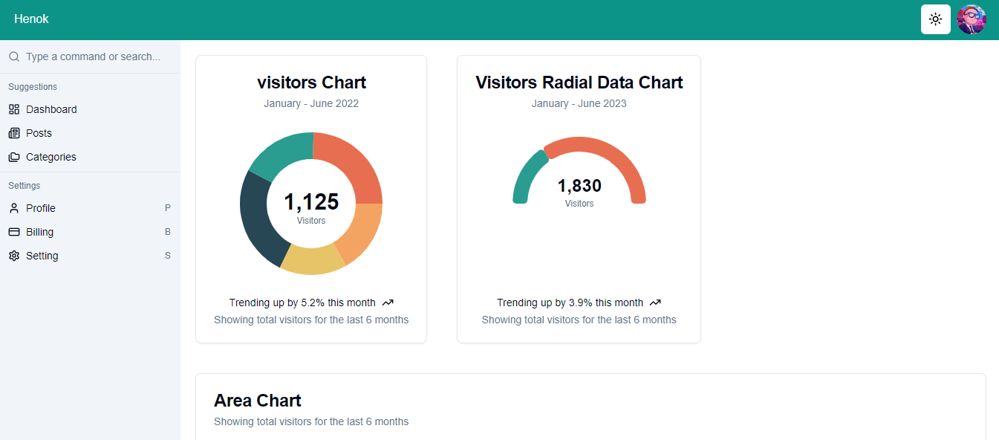
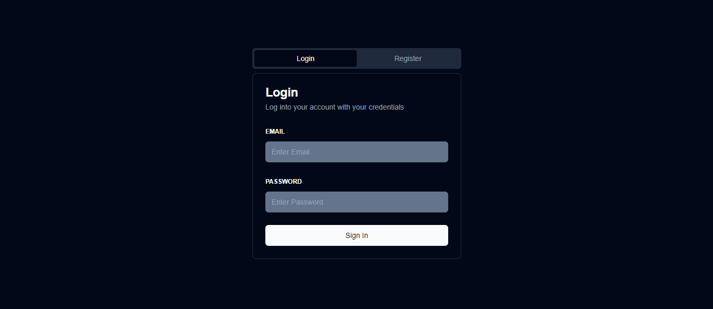

This is a [Next.js](https://nextjs.org) project bootstrapped with [`create-next-app`](https://nextjs.org/docs/app/api-reference/cli/create-next-app).


##Admin Dashboard UI

Overview
This is an admin dashboard UI built with Next.js. Currently, it serves as a front-end interface utilizing static files for data management. 

##Features

Responsive design for optimal viewing on various devices.
User-friendly interface for managing data and visualizations.
Customizable components using Tailwind CSS and Shadcn/ui.
Packages Used
Next.js / React - Framework for building server-rendered React applications.
TypeScript - Adding static typing to JavaScript.
Shadcn/ui - A utility-first CSS framework for React.
Tailwind CSS - Utility-first CSS framework for creating custom designs.
Recharts - A composable charting library built on React components.
Lucide React - A collection of icons for React applications.
React Hook Form - A performant library for managing forms in React.
Zod - A TypeScript-first schema declaration and validation library.
Next Themes - A library for theme management in Next.js apps.

## Getting Started

First, run the development server:

```bash
npm run dev
# or
yarn dev
# or
pnpm dev
# or
bun dev
```

Open [http://localhost:3000](http://localhost:3000) with your browser to see the result.

You can start editing the page by modifying `app/page.tsx`. The page auto-updates as you edit the file.

This project uses [`next/font`](https://nextjs.org/docs/app/building-your-application/optimizing/fonts) to automatically optimize and load [Geist](https://vercel.com/font), a new font family for Vercel.

## Learn More

To learn more about Next.js, take a look at the following resources:

- [Next.js Documentation](https://nextjs.org/docs) - learn about Next.js features and API.
- [Learn Next.js](https://nextjs.org/learn) - an interactive Next.js tutorial.

You can check out [the Next.js GitHub repository](https://github.com/vercel/next.js) - your feedback and contributions are welcome!

## Deploy on Vercel

The easiest way to deploy your Next.js app is to use the [Vercel Platform](https://vercel.com/new?utm_medium=default-template&filter=next.js&utm_source=create-next-app&utm_campaign=create-next-app-readme) from the creators of Next.js.

Check out our [Next.js deployment documentation](https://nextjs.org/docs/app/building-your-application/deploying) for more details.




